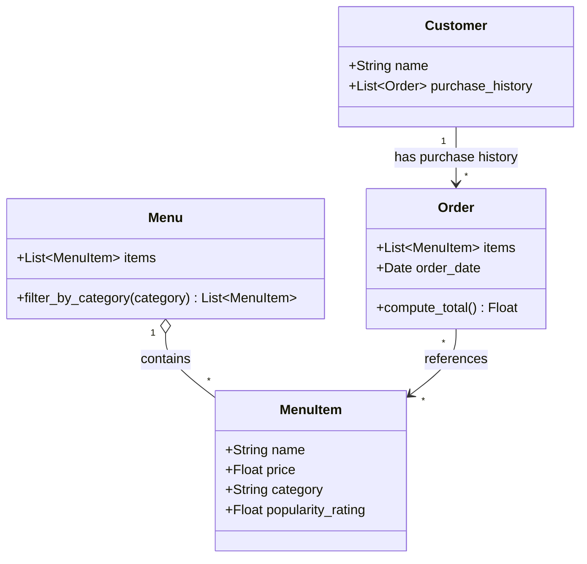

# ByteBites — UML Class Diagram

<!--
  Customer  - Represents a registered user with a name and full order history (including dates).
  MenuItem  - A single food item on offer, tracking its name, price, category, and popularity.
  Menu      - The master catalog of all available items; supports filtering by category.
  Order     - A single transaction grouping selected items, the date placed, and the computed total.
-->

